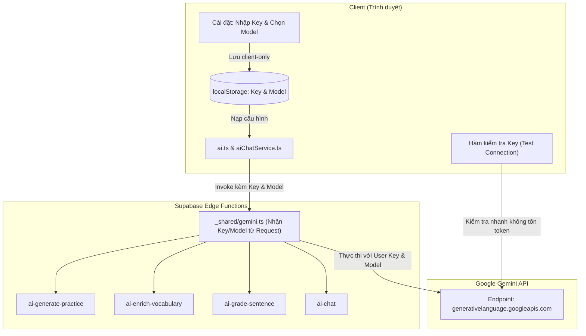

# Kế hoạch Triển khai: Tùy chọn 9 Model & Nhập Gemini API Key (BYOK)

Chuyển đổi toàn bộ kiến trúc AI của WordForge từ việc dùng chung `GEMINI_API_KEY` ở backend sang mô hình **BYOK (Bring Your Own Key)** bắt buộc: người dùng tự cấu hình API Key cá nhân và chọn model Gemini theo nhu cầu, lưu an toàn tại `localStorage` ở client.

---

## 🎯 1. Mục tiêu & Yêu cầu Chính

1. **Bắt buộc nhập Key cá nhân (Tùy chọn B):** Không sử dụng key hệ thống từ backend. Người dùng muốn sử dụng các tính năng AI (Luyện tập AI, Làm giàu từ vựng, Chấm câu, AI Chat) bắt buộc phải cấu hình API Key riêng.
2. **Quản lý danh sách 9 Model Gemini:**
   - ⚡ **Gemini 2.5 Flash Lite** (10 RPM | 250K TPM | 20 RPD) — ID: `gemini-2.5-flash-lite`
   - ⚡ **Gemini 2.5 Flash** (5 RPM | 250K TPM | 20 RPD) — ID: `gemini-2.5-flash`
   - ⚡ **Gemini 3 Flash** (5 RPM | 250K TPM | 20 RPD) — ID: `gemini-3-flash`
   - ⚡ **Gemini 3.1 Flash Lite** (15 RPM | 250K TPM | 500 RPD) — ID: `gemini-3.1-flash-lite`
   - ⚡ **Gemini 3.5 Flash Lite** (15 RPM | 250K TPM | 500 RPD) — ID: `gemini-3.5-flash-lite` *(Mặc định khuyên dùng)*
   - ⚡ **Gemini 3.5 Flash** (5 RPM | 250K TPM | 20 RPD) — ID: `gemini-3.5-flash`
   - ⚡ **Gemini 3.6 Flash** (5 RPM | 250K TPM | 20 RPD) — ID: `gemini-3.6-flash`
   - ⚡ **Gemini 3.7 Flash** (5 RPM | 250K TPM | 20 RPD) — ID: `gemini-3.7-flash`
   - ⚡ **Gemini 3.8 Flash** (5 RPM | 250K TPM | 20 RPD) — ID: `gemini-3.8-flash`
3. **Bảo mật & Trải nghiệm:**
   - Input password có nút Toggle ẩn/hiện mắt (`show/hide`).
   - Nút **"Kiểm tra kết nối"** (Validate key) kiểm tra trực tiếp và hiển thị trạng thái tức thì.
   - Link trực tiếp tới Google AI Studio để người dùng lấy key nhanh.
   - Lưu trữ client-side tại `localStorage` (không lưu vào DB Supabase để bảo mật tuyệt đối cho người dùng).
   - Truyền key và model qua request headers & body lên các Edge Function theo từng phiên gọi.
   - Báo lỗi chi tiết, dễ hiểu khi key sai, hết quota (429 Rate Limit) hoặc model không khả dụng để người dùng biết đường đổi key/model.

---

## 🏗️ 2. Kiến trúc Luồng Dữ liệu

---

## 📁 3. Kế hoạch Thay đổi Code Chi tiết

### Bước 1: Tạo Module Quản lý Cấu hình AI ở Client
- **File mới:** [`src/lib/aiSettings.ts`](file:///d:/code/WordForge/src/lib/aiSettings.ts)
  - Khai báo danh sách 9 models kèm quota (RPM, TPM, RPD).
  - Cung cấp:
    - `getAiConfig()`: Đọc `apiKey` và `model` từ `localStorage`.
    - `saveAiConfig(apiKey: string, model: string)`: Lưu cấu hình.
    - `testAiKey(apiKey: string, model: string)`: Gọi endpoint metadata Google AI để validate key tức thì mà không tiêu tốn token.

### Bước 2: Nâng cấp Giao diện Cài đặt (Settings Page)
- **File:** [`src/pages/SettingsPage.tsx`](file:///d:/code/WordForge/src/pages/SettingsPage.tsx)
  - Trong section `AI Practice`:
    - Khi Toggle `Bật tính năng AI` bật:
      - Ô chọn Model Dropdown với 9 tùy chọn và nhãn hiển thị hạn mức chi tiết.
      - Ô nhập `Gemini API Key` với nút toggle icon con mắt (ẩn/hiện).
      - Nút `Kiểm tra kết nối` kèm thông báo trạng thái kết quả (Thành công / Thất bại kèm lý do).
      - Link mở `Google AI Studio` (`https://aistudio.google.com/app/apikey`).
    - Cập nhật dòng lưu ý bảo mật: Key lưu an toàn trên máy cá nhân, không upload lên database.
- **File:** [`src/styles.css`](file:///d:/code/WordForge/src/styles.css)
  - Thêm styling cho password group (input + show/hide button), status badges cho kết quả test key, select dropdown cải tiến.

### Bước 3: Cập nhật Client Services
- **File:** [`src/lib/ai.ts`](file:///d:/code/WordForge/src/lib/ai.ts)
  - Trước khi gọi invoke Edge Function: kiểm tra xem có `apiKey` không. Nếu chưa có -> ném lỗi tiếng Việt thân thiện: `"Bạn chưa nhập Gemini API Key. Vui lòng vào Cài đặt để thiết lập."`
  - Đính kèm `apiKey` và `model` vào `body` và `headers` (`x-gemini-api-key`, `x-gemini-model`).
  - Xử lý các mã lỗi 401, 403, 429 và hiển thị thông báo rõ ràng cho người dùng.
- **File:** [`src/lib/aiChatService.ts`](file:///d:/code/WordForge/src/lib/aiChatService.ts)
  - Bổ sung nạp `apiKey` và `model` tương tự cho AI Chat.

### Bước 4: Cập nhật Backend Supabase Edge Functions
- **File:** [`supabase/functions/_shared/cors.ts`](file:///d:/code/WordForge/supabase/functions/_shared/cors.ts)
  - Bổ sung `x-gemini-api-key, x-gemini-model` vào `Access-Control-Allow-Headers`.
- **File:** [`supabase/functions/_shared/gemini.ts`](file:///d:/code/WordForge/supabase/functions/_shared/gemini.ts)
  - Cập nhật `callGemini`: nhận `apiKey` và `model` từ tham số hoặc headers/body.
  - Xóa bỏ việc phụ thuộc vào `Deno.env.get('GEMINI_API_KEY')`.
  - Phân tích chi tiết HTTP error từ Gemini API (401/403 sai key, 429 vượt quota/rate limit) để trả về thông báo lỗi dễ hiểu cho người dùng.
- **Các Edge Functions:**
  - [`supabase/functions/ai-generate-practice/index.ts`](file:///d:/code/WordForge/supabase/functions/ai-generate-practice/index.ts)
  - [`supabase/functions/ai-enrich-vocabulary/index.ts`](file:///d:/code/WordForge/supabase/functions/ai-enrich-vocabulary/index.ts)
  - [`supabase/functions/ai-grade-sentence/index.ts`](file:///d:/code/WordForge/supabase/functions/ai-grade-sentence/index.ts)
  - [`supabase/functions/ai-chat/index.ts`](file:///d:/code/WordForge/supabase/functions/ai-chat/index.ts)
  - Trích xuất `apiKey` và `model` từ request và truyền vào `callGemini`.

---

## 🧪 4. Kế hoạch Kiểm thử & Xác minh

1. **Build & Typecheck:**
   - Chạy `npm run typecheck` để kiểm tra tính toàn vẹn kiểu dữ liệu.
   - Chạy `npm run test` để đảm bảo các unit test hiện có pass 100%.
2. **Kiểm thử Thủ công:**
   - Kiểm tra giao diện Cài đặt: Toggle bật/tắt, dropdown 9 model, ẩn/hiện API key.
   - Kiểm tra nút "Kiểm tra kết nối" với key không hợp lệ (báo lỗi đỏ) và key hợp lệ (báo xanh).
   - Kiểm tra các tính năng AI khi chưa có key: Báo thông báo rõ ràng yêu cầu nhập key trong Cài đặt.
   - Kiểm tra các tính năng AI khi có key: Luyện tập AI, Làm giàu từ vựng, Chấm câu, AI Chat hoạt động chuẩn xác với đúng model đã chọn.
